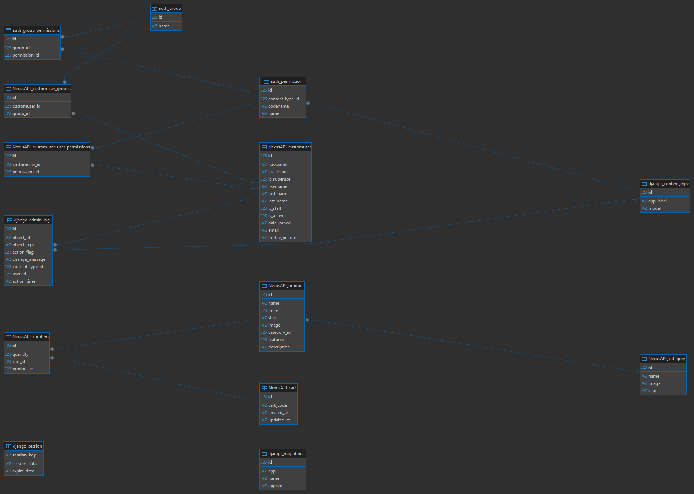

!SLIDE
# Nexus E-Commerce Platform
**Backend API Overview**  
A full-featured e-commerce platform backend built with Django, supporting multi-vendor and single-seller stores.

!SLIDE
# Project Objective
- Demonstrate advanced backend engineering skills  
- Product & inventory management  
- Order lifecycle & tracking  
- Secure payment processing  
- Extensible architecture for production use

!SLIDE
# ERD & Data Model
  
**Explanation:**  
- Users: Customers, Sellers, Admin  
- Products: Categories, variants, media  
- Orders: Multi-vendor checkout, status tracking  
- Payments: Gateway integration & payouts

!SLIDE
# Key Endpoints & Features
- **Product Management:** CRUD, media, variants, inventory  
- **Catalog & Search:** Filters, pagination, full-text search  
- **Cart & Checkout:** Persistent carts, multi-item checkout  
- **Orders & Fulfillment:** Status updates, shipping tracking  
- **Payments & Payouts:** Secure processing, multi-vendor payouts  
- **Accounts & Roles:** Customers, sellers, admin roles  
- **Promotions:** Coupons, discounts, pricing rules

!SLIDE
# Tools & Frameworks
- **Backend:** Django, Django REST Framework  
- **Database:** SQLite (dev), PostgreSQL (production-ready)  
- **Authentication:** JWT, session-based auth  
- **Testing & Validation:** Django forms, DRF serializers, unit tests  
- **Best Practices:** RESTful API design, role-based access, secure payment handling

!SLIDE
# Deployment Summary
- Hosted on [Add your deployment platform here, e.g., Heroku/AWS]  
- Supports multi-vendor marketplace  
- Scalable architecture  
- Secure authentication & transaction handling

!SLIDE
# Conclusion
- Robust, production-ready Django backend  
- Extensible for future features  
- Full e-commerce lifecycle support  
- Ready for integration with frontend/UI
